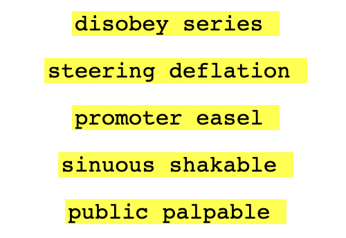

===========
Future Work
===========

In this section we cover topics that are well progressed in terms
of design thinking, but not finalize (or implemented) yet.

Curve25519 Support
------------------

We currently use ECDSA (Elliptic Curve Digital Signature Algorithm)
to generate channel names. There are some concerns with this curve,
however, we consider the support of it by major browser vendors as
preferable over the possible improvement from using another curve,
which would require significant custom code. Recall that one of
our design principles is that core of SB should all fit into a 
single typescript library with no external dependencies, and one
that is as simple to read and understand by humans as possible.

One candidate replacement is Ed25519 (which for example was chosen
for recent revisions of Onion and IPFS) and Curve448. NIST has
announced that both will be included in FIPS-186-5.

It seems likely that support for both of these will be added to
the standard web crypto api, and we plan to simply follow that
development. In the SB protocol, we will be adding meta data on
what algorithm was used to generate the channel name. (For
backwards compatibility, if no such information exists, default
assumption is that ECDSA P-384 was used).

* https://developer.mozilla.org/en-US/docs/Web/API/SubtleCrypto/sign#ecdsa

* https://datatracker.ietf.org/doc/html/rfc7748 

* https://datatracker.ietf.org/doc/html/rfc6090 

* https://chromestatus.com/feature/4913922408710144

* https://docs.google.com/document/d/1fDTUY3HVAXehi-eSfbi7nxh8ZPw4MpSKM8U1fMdqJlU

* https://csrc.nist.gov/publications/detail/fips/186/5/draft

* https://www.rfc-editor.org/rfc/rfc8032#section-5.1

* http://safecurves.cr.yp.to/

* http://ed25519.cr.yp.to/ed25519-20110926.pdf

* https://github.com/libp2p/specs/blob/master/peer-ids/peer-ids.md 

Not directly relevant, but there is some interesting discussion of the
issues with the Onion v3 privacy improvements:

https://blog.torproject.org/v3-onion-services-usage/

Similar issues in the area of brute-forcing a global identifier. In the
case of SB, we don't have an opinion on directory services (e.g. discovery
of where a channel is being served from), but we do want to take into
consideration issues any directory service somebody else builds for SB
channels will run into. We were not aware of the Onion V3 address format
when we first designed SB channel names, but we did design it to be a
64-byte name (currently an iterated hash of the 64-byte public key)
compared to 16 characters for Onion V2 and 56 for V3.

Verifying Room Integrity
------------------------

This needs to be thought through more, consider the below as
tentative: the whole process of how to securely "disconnect" from a
server, in what steps exactly, is a bit unclear.

A room that is both ‘restricted’ and where the Owner has taken control
(‘rotated’) their ownership keys, is loosely referred to as a
‘locked-down’ room. The objective is that a locked-down room is
entirely under the control of the Owner in a manner where no other
party can impersonate the Owner (without having access to their
private owner keys).

The idea is that if you are setting up a group discussion, you may be
using the SSO and other services to initiate the composition of
participants. Then, once that’s accomplished, the concept of ‘locking’
is to eliminate the ability of the SSO to override (impersonate) Owner
identity, whether that may happen through action by an entity
controlling the SSO, or a sufficient subset of underlying
infrastructure providers. [#f028]_

This raises a well-known challenge: how do you, as a user, ascertain
that there was no manipulation of any part of the setup leading up to
this final state?

The short answer is that there isn’t really a way to accomplish
that. Instead, our solution is to make it simple for participants to
pairwise verify the integrity of the final result. Said final
result from every participants’ point of view is simply the room name
and the set of all participants’ public keys. If all participants have
the exact same final result, then there could not have been
manipulation. [#f029]_

When a room is locked down (both verified and the owner has rotated
keys), for users who are verified a new "lock" icon appears next to
the room name. Pressing that lock will produce the verification image:

The above image is generated as follows:

A string is generated by concatenating the <roomId> with every
participants’ public keys, the latter in alphanumeric order. The
*number* of participants seen by the client is noted ('N')

This string is then hashed (SHA-256) and the result is folded (x-or’d)
once upon itself, and the last 8 bits dropped, to generate a 120-bit
‘signature’ of the room’s ‘final state.’ This signature should be
*identical* for all participants.

The presentation is done by translating in chunks of 12 bits to a
passphrase dictionary (4096-word list). This results in 10 words in
two columns of 5. The participant count is displayed prominently as
well.

This signature would then obey the transitive property: all
participants can pairwise confirm that they have the same
signature. Words are superior to QR codes or fancy images - they can
be written down, they can be read over the phone, they are (much)
easier for the human mind to "match", and they involve a minimum of
additional risk (e.g. malicious QR codes etc).

An alternative approach to showing images is to pairwise challenge
(automatically) through the room. Since the 'room signature' can be
viewed as a shared secret that all participants have (and that should
be identical to everybody), a simply pairwise execution of the
*socialist millionaires' problem*, for example the algorithm proposed
by Boudt, Schoenmakerrs, and Traore
(https://www.win.tue.nl/~berry/papers/dam.pdf). 

|

.. rubric:: Footnotes

.. [#f028] Whether or not the entity controlling the SSO is aware of
	   such interference.

.. [#f029] Here is why: all individual participants’ keys are
	   generated locally to their client and the private half is
	   never on the network. So from the perspective of each
	   participant, if every other participant has the same view
	   of their public key, then it wasn’t tampered with. The
	   verification then applies this to all participants. This
	   leaves open the possibility of one or more clients having
	   been tampered with at some point in the process; this
	   security risk is discussed below in the ‘Static Client’
	   section.

