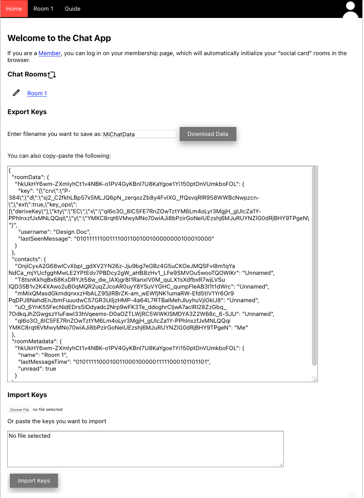

.. _introduction:

============
Introduction
============

One-to-one messaging or group messaging is the same in snackabra,
everything centers around a "room". You access a room with it's unique
URL, that will look something like this:[#f02]_

::

   https://s.privacy.app/hkUkHY6wm-ZXmIyhCt1v4NBK-o1PV4GyKBnl7U8KaYgoe1Yi150ptDnVUmkboFOL

First time you visit any room you will see a welcome message to assign yourself an alias:

.. figure:: _static/welcome-message.png
   :target: _static/welcome-message.png
   :figwidth: 40%

   Typical first-time-visitor message.
	      
Type something in the box, and you're in the chat room:

.. figure:: _static/sample-room.png
   :target:  _static/sample-room.png
   :figwidth: 40%
	   
   Sample view of a room.

The above is from our current web interface, a native iOS app is under
development, but the "web app" interface is designed to work
(decently) on mobile browsers.[#f06]_

Message Types
-------------

In the `above screenshot <_static/sample-room.png>`_ of a sample room,
all the main message types are demonstrated:

* Purple border (glimpsed at the top) indicates a Verified guest.
  "Verified" guest means that this was the first visitor to enter
  the room, other than the owner/Admin. If you've been invited
  by an Owner to join their room for a one-to-one communication,
  then you will be labelled as Verified.

* Green border means Owner or Admin. All rooms have an Owner.
  An Owner can be present in the room in different ways, incognitor
  as a Guest, or as an Owner. "Admin" simply means the Owner
  has logged in with full authentication, which is required for
  certain Owner actions.

* No border means regular Guest.

* Yellow filled bubbles are "Whispers".

Your messages are shown on the right, and everybody else's on the left.

Right away on entering a room you might note some important things:

* You're not required to register, log in, pick a password. 

Room Keys
---------

A lot happened in your browser in the above simple steps. The snackabra web client
loaded, and checked for any state in your "local storage" (in your browser). If there's none,
it initializes that data for you. You can see the results by selecting the "Home" tab:

	   
   Sample view of a basic home page.

If this is your first time using any snackabra chat rooms, you should
see something very similar to the above. It shows a link to the one room
that you've visited so far ("Room 1"), and amongst other things, gives you
an option to export or import your "keys". We've expanded the text box a bit
so you can see the full set of "keys". Let's talk about those a bit.

When you first try to enter the room, you are just a "Visitor", and behind
the scenes the snackabra web app will initialize local data with basics
about the room you're trying to connect to:

:: 

   {
     "roomData": {},
     "contacts": {},
     "roomMetadata": {
       "hkUkHY6wm-ZXmIyhCt1v4NBK-o1PV4GyKBnl7U8KaYgoe1Yi150ptDnVUmkboFOL": {
	 "name": "Room 1"
       }
     }
   }

This is all that snackabra knows about you so far - that you're trying
to access a room with identy ``hkUkHY6wm...``. You haven't "entered"
the room yet - the room requires your alias string before admitting
you.

At this point you're a "visitor" and at first the system doesn't know
anything about you.  Visitors are either Guests or Owners. Guests can
be Verified (or not), and Accepted (or not), and Owners can also be
Admin. More on all this shortly:

.. graphviz::
   :align: center
   :caption: Basic categories of visitors
	   
   digraph visitors{
	   size="6,6";
       node [shape="record", color=lightgrey]; Guest;
	   node [color=lightblue2, style=filled];  Visitor; Owner; Admin
	   "Visitor" -> Guest;
	   "Visitor" -> "Owner" [label="  Keys Match Room?  ", fontsize="10"];
	   "Owner" -> "Admin" [label="  Cookie Present?  ", fontsize="10"];
       Guest [label="Guest: \n|{Verified?|Accepted?}"];
   }

A typical first-time visitor is a straight-up Guest (neither Verified
nor Accepted).  The app now generates more state, which is what you
actually see when you go to the Home tab:[#f05]_

::

   {
     "roomData": {
       "hkUkHY6wm-ZXmIyhCt1v4NBK-o1PV4GyKBnl7U8KaYgoe1Yi150ptDnVUmkboFOL": {
	 "key": {"crv":"P-384",
	         "d":"sj2_C2fkHLBp57X5MLJq6pN_ZErq0zZb8y4FvIXG_ffQsvqRlR958MMBcNwpzcn-",
		 "ext":true,
		 "key_ops":["deriveKey"],
		 "kty":"EC",
		 "x":"ql6o3O_8IC5fE7RnZOwTZtYm6Lm4oLyr3MgjH_gUIcZa1Y-PPhInxzfJxMNLQQqi",
		 "y":"YMKC8rqt6VmwyMNo70wiAJi8bPzIrGoNeIUEzShj6MJuRUYnZlG0dRjBHY9TPgeN"
		},
	 "username": "Design Doc",
	 "lastSeenMessage": "010111111001111001100100100000000100010000"
       }
     },
     "contacts": {
       "OnjiCyxa5G68wlCvXbpI_gdXV2YN26z-Jju9bg7eGBz4G5uCKOeJMQSFvI8m1qYa NdCa_mJYUcfgghMwLE2YPtEdv7PBDcy2gW_aHB8zHv1_LFe9SMVOu5wooTQOWIKr": "Unnamed",
       "T8tsnKkhqCx68KxDRYJt58w_dw_lAXjgr8I1RanxIV0M_quLX1sXdfbxR7wjLVSu lQD3521v2K4XAwo2uB0qMQR2uqZJcoAR0uyY8YSuVYGHC_qumpFleAB3I1t1dWrc": "Unnamed",
       "mMixQMasdGKMdqnxxzHbALZ95jIRBrZK-am_wEWfjNK1umaRW-Efd5tIV1Yr6Or9 PqDPj8NahdEnJbmFuuudwC57GR3UiljzHMP-4a64L7RTBaiMehJluyhuVjiOklJ8": "Unnamed",
       "uO_6YnK55FecnIdEDrs5IDdyadc2Nrp9wFK3Te_ddoghrCljwA7acIRI28ZzGbq_ 7OdkqJhZgwgsZYIuFawl33hVqeems-D0aOZTLWjRC5WWKlSMDYA3Z2W68c_6-SJU": "Unnamed",
       "ql6o3O_8IC5fE7RnZOwTZtYm6Lm4oLyr3MgjH_gUIcZa1Y-PPhInxzfJxMNLQQqi YMKC8rqt6VmwyMNo70wiAJi8bPzIrGoNeIUEzShj6MJuRUYnZlG0dRjBHY9TPgeN": "Me"
     },
     "roomMetadata": {
       "hkUkHY6wm-ZXmIyhCt1v4NBK-o1PV4GyKBnl7U8KaYgoe1Yi150ptDnVUmkboFOL": {
	 "name": "Room 1",
	 "lastMessageTime": "010111110001001100010000011111000101101101",
	 "unread": true
       }
     }
   }   

These are your "keys". We will explain the components briefly in this
overview, and then in detail elsewhere in the document. These are all
stored in your browser's ``localStorage`` [#f07]_. That's a small
database handled by your browser, whether you are on a computer or on
a mobile phone.

This is important: **you are responsible for not losing these
keys**. You can hit the "Export" button on your Home tab, and save
them as a file - on your phone or your computer, or email them to
yourself. If you are using a mobile app, then you won't necessarily
see this data at all and the app will manage it for you on your
device. More on this later.

Sequence Diagrams
-----------------

First let's introduce the type of sequence diagrams that we will be
using in these docs:

.. seqdiag::

    seqdiag {

      default_fontsize = 18;  // default is 11
      default_note_color = lightblue;
      activation = none; // Do not show activity line
      span_height = 20;  // default value is 40

      edge_length = 300;  // default value is 192

      A -> B [label = "This shows a request of some sort"];
      B ->> A [label = ".. and this is the reply"];
      B -->> A [note = "Dotted line means the\nreply is optional"];
      A -> A [note = "Local Storage"];
      A --> B [label = "This is something that MIGHT happen"];
      A => B => C [label = "This asks 'B' to get something from 'C'"];
    }

Note that the "solid" arrowhead is something initated, and if there
is a regular arrow immediately after then, that is the reply.
If the line is dotted, it's optional - an optional reply, or
an event that "might" happen. 

Basic Connection
----------------

Here's roughly what's going on. Let's say you're connecting to
"example.com/<room...>" with a browser (on a computer or on a phone,
doesn't matter, you're using a "web client" / "web app"):

.. seqdiag::

    seqdiag {
      "example.com"; browser; room; // storage;

      // defaults
      default_fontsize = 18;  // default is 11
      // autonumber = True;
      default_note_color = lightblue;

      // also available:
      // edge_length = 300;  // default value is 192
      // span_height = 80;  // default value is 40
      activation = none; // Do not show activity line

      span_height = 20;  // default value is 40

      browser -> "example.com" [label = "<site>/hkUkHY.. [1]"];
      "example.com" ->> browser [label = "Web App [2]"];
      browser -->> browser [label = "Load Keys [3]"];
      browser -> room [label = "Connect [4]"];

      browser -> room [label = "Personal Public Key [5]"]
      room ->> browser [label = "Room Keys and info [6]"];
      browser -> room [label = "ready! [7]"];
      browser <<- room [label = ".. latest 100 msgs [8]"];

      browser <-- room [label = "new msg! [9]"];
      browser <-- room [label = "new msg! [9]"];
      browser <-- room [label = "new msg! [9]"];

      // browser => room => storage [label = "get image", return = "image"];
    }

Details on the steps:

1. Your browser connects to "<site>/<roomId>", which returns
   the web application (for example https://github.com/snackabra/snackabra-weblient).
   The client logic is the downloaded web app. This step is optional - if
   you are running your web client locally, or using a mobile app
   (for example https://github.com/snackabra/snackabra-ios), then
   your interaction goes to the next step. For this example we'll
   assume you're using a browser.

2. Web client ("app") fires up.

3. The app checks for crypto keys in the browsers'
   local storage, and will load what's there. If that includes
   keys for the room in question, then it'll use those,
   otherwise it will generate a new "personal public key"
   pair (and store it locally). That's your "real" identity in any room.

4. The app connects (web socket) to the room server. In this example
   we will assume you're connecting to a :term:`Personal Room Server`
   to keep it simple.

5. The first thing the app does is present the user identity (the
   public key from [3]). 

6. The room server will respond with a number of things:
   the room keys (public keys for other participants),
   the :term:`MOTD`, and whether the room is :term:`Restricted` or not.
   
7. Once the app has digested all the info and is all set
   to rock and roll, it sends a "ready" message to the room server.

8. The first thing the room sends upon seeing "ready" is to
   start catching the client up on messages (latest 100).

9. As long as the socket is open, the room server will forward
   anything anybody else adds to the room, in real time.

Now we can connect that back to the state in the previous figure (the
"[N]" notation refers to explanations below the figure):
   
::

   [1] {
        
         "roomData": {
   [2]       "hkUkHY6wm-ZXmIyhCt1v4NBK-o1PV4GyKBn...
             "key": {"crv":"P-384",
   [3]	             "d":"sj2_C2fkHLBp57X5MLJq6pN...
                     "ext":true,
                     "key_ops":["deriveKey"],
                     "kty":"EC",
   [4]		     "x":"ql6o3O_8IC5fE7RnZOwTZtY...
		     "y":"YMKC8rqt6VmwyMNo70wiAJi...
                    },
             "username": "Design Doc",
             "lastSeenMessage": "0101111110011110...
           }
         },
   [5]   "contacts": {
           "OnjiCyxa5G68wlCvXbpI_gdXV2YN26z-Jju9b...
           "T8tsnKkhqCx68KxDRYJt58w_dw_lAXjgr8I1R...
           "mMixQMasdGKMdqnxxzHbALZ95jIRBrZK-am_w...
           "uO_6YnK55FecnIdEDrs5IDdyadc2Nrp9wFK3T...
   [6]     "ql6o3O_8IC5FE7RnZ0wTztYM6Lm4oLyr3MgjH...
         },
         "roomMetadata": {
           "hkUkHY6wm-ZXmIyhCt1v4NBK-o1PV4GyKBnl7...
   [7]       "name": "Room 1",
   [8]       "lastMessageTime": "0101111100010011...
             "unread": true
           }
         }
       }   

1. All this type of information we tend to call "keys", even if
   there's also some meta data. They're stored in JSON format
   in local browser storage (or secure storage on a mobile app).

2. You recognize the room id by now!

3. "d" is magical in EC keys, it's the "private" part of the key.
   This thus keeps your local (secret) private key that corresponds
   to this specific room. All participants get all the public
   keys from all other participants.

4. The "x,y" pair is your public key (so to speak).

5. The "contacts" section simply lists the identities of everybody
   else on the chat. The room server tracks this.

6. And here "we" are, in the list of participants.

7. For ease of (human) use, the client tracks some meta data on the
   room. For example you can assign it a name (only visible to
   yourself).

8. This shows the time stamp of the last seen message.
   We use a time stamp representation that allows for prefix
   searches, more on this later.

It's an important design principle of snackabra that the important
pieces of information is comprehensible, and accessible, to users.
Nothing (important) hidden inside some compiled application, or on
some server.

To reiterate the important bits:

* There is *no global identity* for any users. Your identity is
  always *relative* to a room.

* Rooms are essentially *independent of servers*. A "room"
  is made up of the set of keys that define the participants,
  and the (encrypted) messages that have accrued thus far.

* (Strong) public key cryptography is used throughout to directly
  represent "identities". The public half is visible to various participants
  and servers, globally identifying either a room, or a
  participant within a room.

* The only authentication ever needed is the private half
  of a corresponding key.

You might be asking how we authenticate the room itself? Good question.
It's derived from the "owner key", namely, the (public) key generated
for the "root" participant of the room. When a room is created, what
is actually created is a new personal public key; the room name is
simply derived from this (details later). That means only the individual
with the private half of the owner key can ever prove that they "own"
the room. When rooms are migrated or mirrored, snackabra servers will
only accept the authority provided by that owner, and snackabra clients
can verify that the servers are doing it correctly. [#f08]_
  
This is the gist of it. The biggest part that we're not covering in
this overview is storage - how to share photos and files and
documents, while maintaining privacy, secrecy, etc, is the big
"pillar" of snackabra.

|

------------

.. rubric:: Footnotes

.. [#f02] That's a `real link <https://s.privacy.app/hkUkHY6wm-ZXmIyhCt1v4NBK-o1PV4GyKBnl7U8KaYgoe1Yi150ptDnVUmkboFOL>`_,
          you can join it to discuss this design document.

.. [#f05] Here we are cleaning it up a little so it's easier to read, the actual
          string will have some escape characters etc so that it can be stored
          and re-loaded and re-parsed.
          
.. [#f06] It's important to note that this is just our reference web app user
          interface - the important parts of snackabra are various protocols and
          formats, hopefully allowing anybody that wants to develop their own
          apps (or add chat features to web sites or apps) to take their own
          approach.

.. [#f07] https://developer.mozilla.org/en-US/docs/Web/API/Window/localStorage

.. [#f08] Regardless, it's not very useful to spoof ownership, since
	  unless you were a participant, you can't untangle and read
	  the message history anyway.
	            
